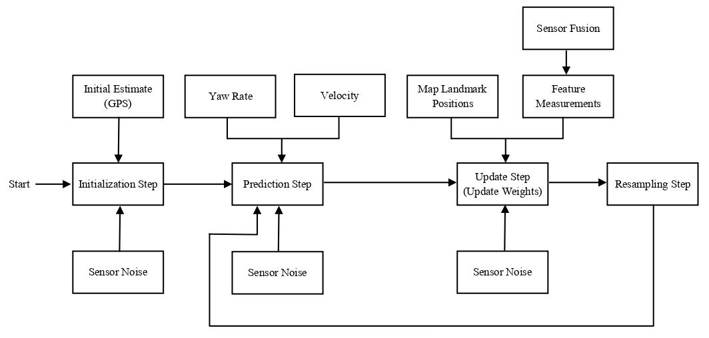

# Particle Filter Based Localization 

#### The objective of this project is to develop a software pipeline using <a href="https://en.wikipedia.org/wiki/Particle_filter" target="_top">Particle Filter</a>  to pinpoint the location and yaw of an autonomous vehicle within a specified error range inside a global map in real-time. The vehicle is provided with an initial noisy GPS estimate, a map with locations of various landmarks (i.e., buildings, traffic signs, street corners, etc.), and a set of lidar and control (i.e., yaw rate and velocity) measurements over time. I will describe the steps involved in developing the intended software pipeline in the following sections. 
<p> </p>

## Prerequisites
- To begin with, Udacity provides a [starter code](https://github.com/udacity/CarND-Kidnapped-Vehicle-Project/) for this project. This code uses WebSocket communication protocol to establish the communication between the particle filter software pipeline, i.e., the server-side, and [Udacity's Term 2 Self-Driving Car Simulator](https://github.com/udacity/self-driving-car-sim/releases), i.e., the client-side. 
- The particle filter will use noisy lidar and control measurements generated by the simulator to estimate the loccation and yaw of the vehicle. 
- The main program can be built and run by executing the following commands from the project top directory.
```
mkdir build
cd build
cmake ..
make
./particle_filter
```
## Localization Software Pipeline
The below flowchart depicts the steps of the particle filter algorithm and inputs. 

<td>  </td>

The software pipeline that I have developed can be divided into four key steps including, initialization, prediction, particle weight updates, and resampling.

* Initialization: As a first step, I have randomly initlized a set of particles (a particle mainly contains the location and yaw of the vehicle) using initial noisy GPS estimate and a normal (or Gaussian) distribution. Also, each particle weight is intialized as 1, which will be adjusted in the update step. The subsequent steps will refine this estimate to localize the vehicle. 
* Prediction: In this step, I have predicted the state of particles based on the noisy control input (i.e., yaw rate and velocity) measurements following a bicycle motion model.
* Update Weights: As a next step, I have identified the map landmarks within the lidar range using predicted states of the particles. Then, I have transformed the lidar observations from vehicle's coordinate system to the map's coordinate system by perfroming rotation and translation as the particles are in map's coordinate system. Thereafter, I have associated the lidar observations with the closest predicted landmarks. Finally, I have updated the weight of the particles based on the probability calculated from landmark association and mult-variate Gaussian distribution.
* Resampling: At last, I have resampled the particles with probability proportional to their weight to refine the estimate of the vehicle location and yaw. The resampling step follows the idea of the survival of the fittest as new particles in the proximity of the particles with higher weights substitute the particles with lower weights. In general, the particles consistent with the lidar measurements are more likely to be selected and chosen multiple times than the inconsistent particles. 

The sofware pipeline repeats these steps while is vehicle is moving to keep refining the location and yaw estimate of the vehicle.

## Implementation Details
The source code files associated with the pipeline are included in `src` folder of this repository and are listed below.
```
src
│───particle_filter.h
│───particle_filter.cpp
│───map.h
│───helper_functions.h
│───json.hpp
│───main.cpp
```

A brief overview of these files is provided as follows.
- `particle_filter.h`: It contains the declaration of the `ParticleFilter` class. This class includes structure of particle, variable to store number of particles, a vector of particles, a vector of weights, and member functions `init()`, `prediction()`, `dataAssociation()`, `updateWeights()`, `resample()`, and `initialized()`.  
- `particle_filter.cpp`: It consists of the definition of the `init()`, `prediction()`, `dataAssociation()`, `updateWeights()`, `resample()`, and `initialized()` functions. These functions implements the logics to initialize particles, predict the vehicles's location, determine the association of predicted landmarks with lidar measurements, update weight of the particles, resample the particles, check if particles are initialized, respectively.
- `map.h`: It comprises of the declaration of the `Map` class having structure of landmark and a vector of landmarks. 
- `helper_functions.h`: It declares structures of control measurements, ground truth, and landmark object and implements a function to read map data from a file. 
- `json.hpp`: It is an open source single-header C++ library for handling JSON.
- `main.cpp`: It establishes a TCP connection between the simulator and the software pipeline. The simulator then transmits the GSP (only in the first iteration), control and lidar measurements to the `main.cpp`, which is then passed to the localization software pipeline. Next, the localization software pipeline processes this data to initialize or update the particles. Finally, it also calculates the average and highest weight of the particles and transmits the particle with hightest weight back to the simulator.

